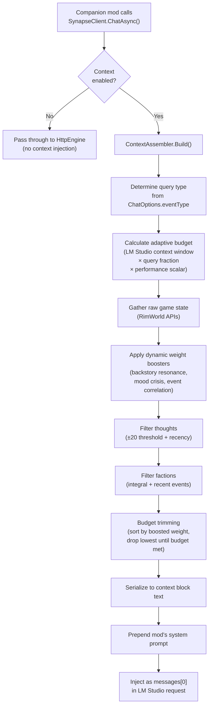

# Context Embedding — Planning Iteration 1

> This is the first reviewed iteration of the context embedding design.
> It incorporates all feedback from the initial plan review.
> **Status:** Pending second review.

---

## 1. Design Philosophy Changes from v0

The initial plan treated context as a static taxonomy with fixed weights. After review, the design has shifted fundamentally:

| v0 Assumption | v1 Direction |
|---|---|
| Fixed weight per slot | **Dynamic weighting** — weights calculated from in-game state correlations |
| Token budget is a user-set number | **Adaptive budget** — derived from LM Studio's reported context window, scaled by query type, shrinks under poor performance |
| Faction data = simple table | **Faction relationship integral** — area-under-the-curve over time, with power/ideology/opportunity factoring into decisions |
| Thoughts = top N by impact | **Threshold-based** — include anything past ±20 mood impact OR recency-flagged |
| One system prompt for all | **Per-mod system prompts** — each companion mod defines its own system prompt; Core injects weighted context alongside it |
| Context is read-only observation | **Context drives action** — Chat can trigger universe-changing actions (in-memory); Psychology/Storyteller form persistent memories |

---

## 2. The Context Injection Model

### Per-Mod System Prompts

Each companion mod registers its own system prompt when it calls `SynapseCore.Register()`. The Core mod's context layer then **appends structured context data** alongside that prompt, rather than replacing it.

```
┌──────────────────────────────────────────────────────────┐
│  LM Studio Request                                       │
│                                                          │
│  messages[0] = {                                         │
│    role: "system",                                       │
│    content:                                              │
│      [MOD'S SYSTEM PROMPT]           ← mod-defined       │
│      ---                                                 │
│      [CONTEXT BLOCK]                 ← Core-injected     │
│        • Pawn identity & personality                     │
│        • Mood / thoughts (threshold-filtered)            │
│        • Relationships & opinion integrals               │
│        • Colony state (if event type needs it)           │
│        • Faction integrals (if event type needs it)      │
│        • Narrative threads (if active)                   │
│        • Weighted memories (if Psychology loaded)        │
│  }                                                       │
│                                                          │
│  messages[1..N] = { user/assistant conversation }        │
└──────────────────────────────────────────────────────────┘
```

### Why Per-Mod Prompts + Core Context (Not Too Permissive)

This is the right balance for two reasons:

1. **Mod authors know their domain.** The Chat mod knows it needs "respond in character as this colonist." The Storyteller mod knows it needs "generate a narrative event fitting this colony state." Forcing a single system prompt would either be too generic or require a complex template system that duplicates what mod authors already know.

2. **Core controls the data contract.** The context block is structured and weighted by Core — mod authors don't build their own game-state queries. This means every mod gets consistent, budget-aware context without duplication. The "permissive" part (mod-defined prompts) is constrained by the "strict" part (Core-managed context data).

**The risk of too-permissive** would be if mod authors could also override weighting or bypass budget trimming. We prevent that: mods provide a system prompt string and optionally request specific context tiers, but Core always enforces the token budget and weight thresholds.

### Updated Registration API

```csharp
public static class SynapseCore
{
    /// <summary>
    /// Register a consumer mod. The systemPrompt is used as the base
    /// system message for all requests from this mod.
    /// </summary>
    public static SynapseModHandle Register(
        string modId,
        string displayName,
        string systemPrompt = null);  // NEW — mod's default system prompt
}

public class SynapseModHandle
{
    // ... existing fields ...

    /// <summary>
    /// The mod's base system prompt. Can be updated at runtime.
    /// Core appends context data after this prompt.
    /// </summary>
    public string SystemPrompt { get; set; }

    /// <summary>
    /// Context tiers this mod wants by default.
    /// Can be overridden per-request via ChatOptions.
    /// </summary>
    public ContextTierMask DefaultTiers { get; set; } = ContextTierMask.Standard;
}

[Flags]
public enum ContextTierMask
{
    None          = 0,
    Identity      = 1 << 0,   // Tier 1: name, backstory, traits
    PawnState     = 1 << 1,   // Tier 2: mood, skills, health, social
    Colony        = 1 << 2,   // Tier 3: colony stats, weather, threats
    World         = 1 << 3,   // Tier 4: factions, quests, settlements
    Synthetic     = 1 << 4,   // Tier 5: memories, personality, threads

    // Preset combinations
    Standard      = Identity | PawnState | Synthetic,
    Full          = Identity | PawnState | Colony | World | Synthetic,
    ColonyEvent   = Identity | Colony | World,
    Lightweight   = Identity,
}
```

---

## 3. Adaptive Token Budget

The token budget is **not a fixed user setting**. It's derived dynamically from three factors:

### Budget Calculation

```
availableContextWindow = ModelManager.ContextLength       // from LM Studio
                         ?? 4096                          // fallback default

reservedForCompletion  = max(512, availableContextWindow * 0.25)
reservedForConversation = estimateConversationTokens(messageHistory)
reservedForSystemPrompt = estimateTokens(mod.SystemPrompt)

contextBudget = availableContextWindow
              - reservedForCompletion
              - reservedForConversation
              - reservedForSystemPrompt

// Performance scaling: if recent requests are slow, shrink budget
if (avgResponseTimeMs > 10000)
    contextBudget *= 0.6   // heavy shrink
else if (avgResponseTimeMs > 5000)
    contextBudget *= 0.8   // moderate shrink
```

### Query-Type Scaling

Different query types get different fractions of the available budget:

| Query Type | Budget Fraction | Frequency | Rationale |
|---|---|---|---|
| `thought` | 15–20% of context budget | Every few ticks | Lightweight, high-frequency pawn reactions |
| `dialogue` | 40–60% of context budget | On player interaction | Rich context needed for in-character responses |
| `relationship` | 30–40% of context budget | On social interaction | Focused on relationship data |
| `reaction` | 20–30% of context budget | On event trigger | Quick emotional response |
| `event` / `storyteller` | 60–80% of context budget | Every 2–3 in-game days | Deep, infrequent colony-wide analysis |
| `quest` | 50–70% of context budget | On quest events | Full world state needed |
| `custom` | User-defined or 50% | Variable | Mod-specific |

```csharp
public static class QueryBudgetProfile
{
    public static float GetBudgetFraction(string eventType)
    {
        return eventType switch
        {
            "thought"      => 0.15f,
            "dialogue"     => 0.50f,
            "relationship" => 0.35f,
            "reaction"     => 0.25f,
            "event"        => 0.70f,
            "quest"        => 0.60f,
            "custom"       => 0.50f,
            _              => 0.40f,
        };
    }
}
```

---

## 4. Dynamic Weight Calculation

Weights are **not static numbers**. They start from a base value and are adjusted by in-game correlations. This is the core innovation — making stories feel dynamic by surfacing relevant connections.

### Base Weights (Starting Point)

```
Category                    Base Weight
──────────────────────────  ──────────
Pawn name / identity        10  (required, never dropped)
Event type framing          10  (required, never dropped)
Backstory                    6
Traits                       7
Current mood                 7
Active thoughts              5
Skills                       4
Health/hediffs               5
Direct relationships         6
Opinion integrals            6
Ideology/precepts            4
Colony stats                 4
Faction integrals            4
Weather/season/biome         2
Weighted memories            6
Narrative threads            5
AI personality summary       6
```

### Dynamic Weight Boosters

These rules **elevate** a slot's weight when in-game state creates a meaningful correlation:

```csharp
public static class WeightBooster
{
    /// <summary>
    /// Adjust base weights based on in-game correlations.
    /// Called during context assembly.
    /// </summary>
    public static void ApplyBoosts(ContextSlotSet slots, Pawn pawn, string eventType)
    {
        // ── Backstory Resonance ──
        // If a current event mirrors the pawn's backstory, boost backstory weight.
        // e.g., a raid event + "Child soldier" backstory = highly relevant
        if (HasBackstoryResonance(pawn, slots.RecentEvents))
            slots.Backstory.Weight += 3;  // 6 → 9

        // ── Mood Crisis ──
        // If pawn is near mental break, boost mood + thoughts heavily
        if (pawn.needs.mood.CurLevel < 0.20f)
        {
            slots.Mood.Weight += 3;       // 7 → 10
            slots.Thoughts.Weight += 3;   // 5 → 8
        }

        // ── Relationship Event ──
        // If this is a social interaction, boost relationship + opinion data
        if (eventType == "relationship" || eventType == "dialogue")
        {
            slots.Relationships.Weight += 2;
            slots.OpinionIntegrals.Weight += 2;
        }

        // ── Faction Event Correlation ──
        // If a faction just did something (raid, trade, quest), boost
        // that faction's data even in non-faction query types
        foreach (var faction in slots.Factions)
        {
            if (HasRecentFactionEvent(faction, within: 3 * GenDate.TicksPerDay))
                faction.Weight += 3;  // 4 → 7
        }

        // ── Memory Correlation ──
        // If a weighted memory's tags overlap with the current event context,
        // boost that memory's inclusion priority
        foreach (var memory in slots.Memories)
        {
            if (memory.Tags.Intersect(GetEventTags(eventType, slots.RecentEvents)).Any())
                memory.Weight += 2;
        }

        // ── Health Relevance ──
        // If pawn has a serious condition (e.g., missing limb, addiction),
        // and the event could relate to it, boost health slot
        if (pawn.health.hediffSet.hediffs.Any(h => h.Severity > 0.5f))
            slots.Health.Weight += 2;

        // ── Thread Resonance ──
        // If an active narrative thread's keywords match the event, boost it
        foreach (var thread in slots.NarrativeThreads)
        {
            if (thread.Keyword.ContainsEventRelevance(eventType))
                thread.Weight += 2;
        }
    }
}
```

### Backstory Resonance Detection

This is a key correlation engine — matching backstory keywords against current events:

```csharp
// Backstory keyword → event tag mapping
private static readonly Dictionary<string, string[]> BackstoryEventTags = new()
{
    { "soldier",    new[] { "raid", "military", "combat", "war" } },
    { "medic",      new[] { "injury", "plague", "disease", "medical" } },
    { "noble",      new[] { "royalty", "empire", "politics", "ceremony" } },
    { "slave",      new[] { "slavery", "freedom", "escape", "oppression" } },
    { "scientist",  new[] { "research", "technology", "discovery" } },
    { "farmer",     new[] { "harvest", "food_shortage", "blight", "animals" } },
    { "criminal",   new[] { "prison", "crime", "betrayal", "smuggling" } },
    // ... extensible by mod authors
};

private static bool HasBackstoryResonance(Pawn pawn, List<string> recentEventTags)
{
    string backstoryText = (pawn.story?.childhood?.baseDesc ?? "")
                         + (pawn.story?.adulthood?.baseDesc ?? "");
    backstoryText = backstoryText.ToLowerInvariant();

    foreach (var kvp in BackstoryEventTags)
    {
        if (backstoryText.Contains(kvp.Key))
        {
            if (recentEventTags.Any(tag => kvp.Value.Contains(tag)))
                return true;
        }
    }
    return false;
}
```

---

## 5. Thought Filtering — Threshold + Recency

Thoughts are **not** top-N by impact. They use a dual filter:

### Filter Rules

```
Include a thought if:
  (a) |moodOffset| >= 20    — significant mood impact (positive or negative)
  OR
  (b) age < 12 in-game hours — recent event regardless of impact

Exclude:
  - Stacking duplicates (only include once, note count)
  - Thoughts about to expire (age > 90% of duration)
```

### Implementation

```csharp
public static List<ThoughtEntry> FilterThoughts(Pawn pawn)
{
    var entries = new List<ThoughtEntry>();
    var seen = new HashSet<string>();

    foreach (var memory in pawn.needs.mood.thoughts.memories.Memories)
    {
        float offset = memory.MoodOffset();
        int ageTicks = Find.TickManager.TicksGame - memory.age;
        float ageHours = ageTicks / 2500f;
        float durationHours = memory.def.durationDays * 24f;

        // Skip if about to expire
        if (durationHours > 0 && ageHours > durationHours * 0.9f)
            continue;

        bool significantImpact = Math.Abs(offset) >= 20f;
        bool recentEvent = ageHours < 12f;

        if (significantImpact || recentEvent)
        {
            string key = memory.def.defName;
            if (seen.Contains(key)) continue;
            seen.Add(key);

            entries.Add(new ThoughtEntry
            {
                label = memory.LabelCap,
                moodOffset = offset,
                ageHours = ageHours,
                isRecent = recentEvent,
            });
        }
    }

    // Also include situational thoughts (not memory-based)
    foreach (var group in pawn.needs.mood.thoughts.situational.ActiveSituationalThoughtGroupsSorted())
    {
        float offset = group.MoodOffset();
        if (Math.Abs(offset) >= 20f)
        {
            entries.Add(new ThoughtEntry
            {
                label = group.LabelCap,
                moodOffset = offset,
                ageHours = 0,
                isRecent = true,  // situational = always current
            });
        }
    }

    return entries;
}
```

---

## 6. Faction Relationship Integral System

Factions use the same **area-under-the-curve** approach already designed for pawn opinions in the Psychology mod, but applied to faction goodwill.

### Data Model

```csharp
public class FactionRelationshipTracker : IExposable
{
    public string factionId;
    public List<GoodwillSample> goodwillHistory = new();
    public float goodwillIntegral;           // computed moving average
    public int lastEventTick;                // last faction event tick

    // Computed metrics (not saved, derived on access)
    public float CurrentGoodwill => Find.FactionManager
        .FirstFactionOfDef(/* ... */)?.PlayerGoodwill ?? 0;
    public float Trajectory => CurrentGoodwill - goodwillIntegral;

    // Positive trajectory = relationship improving
    // Negative trajectory = relationship deteriorating

    public void ExposeData() { /* Scribe each field */ }
}

public class GoodwillSample : IExposable
{
    public int gameTick;
    public int goodwill;     // -100 to +100
    public void ExposeData() { /* ... */ }
}
```

### Sampling Schedule

```
Default: Sample every 2 in-game days (120,000 ticks)
Override: Sample immediately when a faction event concludes:
  - Raid from faction
  - Trade caravan arrives/departs
  - Quest involving faction completes
  - Goodwill change from any source
  - Alliance/hostility status change
```

### What Gets Sent to the LLM

```json
{
  "factionName": "Rough Outlanders",
  "factionType": "Outlander Rough",
  "currentGoodwill": -45,
  "goodwillIntegral": -12,
  "trajectory": "deteriorating (was -12 avg, now -45)",
  "recentEvent": "Raided us 2 days ago",
  "power": "strong",
  "ideology": "Individualist",
  "opportunity": "trade routes available but trust is low"
}
```

### Faction Power / Ideology / Opportunity

These additional dimensions give the LLM richer decision-making context:

| Dimension | Source | Values |
|---|---|---|
| **Power** | `faction.def.techLevel` + settlement count + military strength estimate | `weak`, `moderate`, `strong`, `dominant` |
| **Ideology** | `faction.ideos?.PrimaryIdeo?.name` (Ideology DLC) or `faction.def.factionLabel` | Ideology name or faction archetype |
| **Opportunity** | Derived from proximity (nearest settlement distance), trade goods overlap, quest availability | `high`, `moderate`, `low`, `none` |

---

## 7. Action Model — Chat vs Memory Formation

### Chat Actions (In-Memory, Not Persisted to Save)

Chat allows "universe-changing actions" but these affect the **game engine's runtime state**, not the save file directly:

```csharp
public enum ChatActionType
{
    // In-memory effects (game engine, not save)
    MoodBoost,          // Temporary thought added to pawn
    OpinionShift,       // Adjust opinion via game API
    StartConversation,  // Trigger social interaction
    InspireAction,      // Queue a job on the pawn

    // These do NOT write to save:
    // - No Scribe calls
    // - No WorldComponent modifications
    // - Effects are transient unless the game's own systems persist them
    //   (e.g., a thought added via game API will be saved by RimWorld itself)
}
```

### Psychology / Storyteller Actions (Memory Formation, Persisted)

These mods **do** create persistent data:

```csharp
public enum MemoryFormationType
{
    // Psychology: persisted via SynapsePawnComp (ThingComp)
    NewMemory,              // Add a weighted memory to the pawn
    BumpMemoryWeight,       // Reinforce an existing memory
    UpdatePersonality,      // Regenerate personality summary

    // Storyteller: persisted via SynapseWorldComponent (WorldComponent)
    CreateNarrativeThread,  // New story arc begins
    ResolveThread,          // Story arc concludes
    RecordInteraction,      // Log the event for history
}
```

The key distinction: **Chat interacts with the world through RimWorld's own APIs** (which handle their own persistence). **Psychology and Storyteller maintain their own persistent data** via Scribe.

---

## 8. Memory Export for Debug & Compatibility

For mod removal safety and debugging, Core provides a memory export system:

### Export API

```csharp
public static class SynapseDebug
{
    /// <summary>
    /// Export all Synapse data from the current save as a standalone XML file.
    /// Useful for:
    ///   1. Backup before mod removal
    ///   2. Debugging memory/personality issues
    ///   3. Transferring Synapse data between saves
    ///   4. Community sharing of interesting AI personality data
    /// </summary>
    public static void ExportSynapseData(string outputPath)
    {
        // Exports:
        // - All SynapsePawnComp data (memories, opinions, personality)
        // - SynapseWorldComponent data (narrative threads, interaction history)
        // - SynapseContextWorldComponent data (context settings)
        // - Metadata: mod version, export timestamp, pawn name mapping
    }

    /// <summary>
    /// Import previously exported Synapse data into the current save.
    /// Matches by pawn ThingID, falls back to name matching.
    /// </summary>
    public static void ImportSynapseData(string inputPath)
    {
        // Merge logic:
        // - Match pawns by ThingID first, then by name
        // - Append memories (don't overwrite)
        // - Take higher weight if same memory exists
        // - Log unmatched pawns
    }
}
```

### Export File Format

```xml
<?xml version="1.0" encoding="utf-8"?>
<SynapseExport version="1" timestamp="2026-07-07T20:30:00Z" modVersion="1.1.0">
  <Pawns>
    <Pawn thingId="Colonist_42" name="Engie">
      <Memories>
        <Memory>
          <summary>Survived the mechanoid raid on day 45</summary>
          <memoryType>raid</memoryType>
          <tags><li>mechanoid</li><li>combat</li><li>survival</li></tags>
          <weight>0.85</weight>
          <baseWeight>1.0</baseWeight>
          <decayRate>0.05</decayRate>
          <timesReferenced>3</timesReferenced>
        </Memory>
        <!-- ... -->
      </Memories>
      <OpinionHistory>
        <!-- opinion samples -->
      </OpinionHistory>
      <PersonalitySummary>Engie is a resilient, pragmatic colonist who...</PersonalitySummary>
    </Pawn>
    <!-- ... more pawns ... -->
  </Pawns>
  <World>
    <NarrativeThreads>
      <!-- active story threads -->
    </NarrativeThreads>
    <ContextSettings>
      <!-- per-world settings snapshot -->
    </ContextSettings>
  </World>
</SynapseExport>
```

### UI Access

- **DevTools mod**: Button in the dashboard: "Export Synapse Data" / "Import Synapse Data"
- **Core mod settings**: Under Advanced, a "Export Memory Backup" button (export only, no import without DevTools)

---

## 9. Companion Mod Developer Documentation

A detailed README will be published covering the context system. Outline:

### `docs/CONTEXT_API_README.md` — Planned Sections

```
1. Overview
   - What context embedding does
   - How it fits into the request pipeline
   - When context is injected vs when it isn't

2. Quick Start
   - Register with a system prompt
   - Request context tiers
   - Send a chat completion
   - Full working example (15 lines)

3. Context Tiers Reference
   - Tier 1: Identity (always included, ~15 tokens)
   - Tier 2: Pawn State (~250-400 tokens)
   - Tier 3: Colony (~60-100 tokens)
   - Tier 4: World/Factions (~80-200 tokens)
   - Tier 5: Synthetic/AI Data (~100-240 tokens)
   - Token estimates per slot with examples

4. Weight System
   - Base weights table
   - Dynamic boosters (backstory resonance, mood crisis, etc.)
   - How budget trimming works
   - What "required" (weight 10) means

5. Token Budget
   - How the adaptive budget is calculated
   - Query-type scaling table
   - Performance-based shrinking
   - How to estimate your mod's token needs

6. System Prompts
   - How to write an effective system prompt
   - What Core appends after your prompt
   - Per-request prompt overrides
   - Examples for common mod types

7. Event Types
   - Full reference: thought, dialogue, relationship, reaction,
     event, quest, custom
   - Which tiers each type includes by default
   - How to request additional tiers

8. Faction Integral System
   - How goodwill integrals work
   - Sampling schedule
   - Power/ideology/opportunity dimensions
   - How to trigger an immediate faction resample

9. Thought Filtering
   - Threshold rules (±20 mood impact OR <12h age)
   - Situational vs memory thoughts
   - How stacking is handled

10. Memory Formation
    - Chat: in-memory actions (game engine API)
    - Psychology: persistent memories (Scribe)
    - Storyteller: narrative threads (Scribe)
    - When to form memories vs when to keep it transient

11. Save File Integration
    - What gets saved where
    - Mod addition safety
    - Mod removal safety
    - Memory export/import for backup

12. Advanced
    - Custom weight boosters
    - Extending the backstory resonance map
    - Raw mode bypass (skip context entirely)
    - Performance profiling hooks
```

---

## 10. Updated Save File Architecture

```
Save File (.rws)
│
├── <World>
│   └── <components>
│       │
│       ├── <li Class="RimSynapse.SynapseContextWorldComponent">    ← Core mod
│       │   ├── <contextVersion>1</contextVersion>
│       │   ├── <lastContextJson>...</lastContextJson>               ← if persist enabled
│       │   └── <factionTrackers>                                    ← NEW
│       │       └── <li>
│       │           ├── <factionId>...</factionId>
│       │           ├── <goodwillHistory>...</goodwillHistory>
│       │           └── <goodwillIntegral>-12.5</goodwillIntegral>
│       │
│       └── <li Class="RimSynapse.SynapseWorldComponent">           ← Storyteller mod
│           ├── <narrativeThreads>...</narrativeThreads>
│           ├── <interactionHistory>...</interactionHistory>
│           └── <promptLog>...</promptLog>
│
├── <Map>
│   └── <things>
│       └── <thing Class="Pawn">
│           └── <comps>
│               └── <li Class="RimSynapse.SynapsePawnComp">         ← Psychology mod
│                   ├── <synapseMemories>...</synapseMemories>
│                   ├── <synapseOpinionHistory>...</synapseOpinionHistory>
│                   └── <synapsePersonality>...</synapsePersonality>
│
└── ModSettings (Config/RimSynapse.RimSynapseSettings.xml)
    ├── <lmStudioUrl>...</lmStudioUrl>
    ├── <enableContextEmbedding>false</enableContextEmbedding>
    └── ... (no per-world overrides — global only)
```

### Key Change: Faction Trackers in Core

The `SynapseContextWorldComponent` now owns faction goodwill tracking (integral sampling). This means:
- Core can track faction relationships even without the Storyteller mod
- The sampling schedule (every 2–3 in-game days + on faction events) runs in Core's tick loop
- Storyteller mod reads this data rather than duplicating it

---

## 11. Context Assembly Pipeline (Updated)



---

## 12. Proposed File Changes

### New Files

| File | Purpose |
|---|---|
| [ContextPacket.cs](file:///d:/github/RimSynapse-Core/Source/Models/ContextPacket.cs) | All data models: `ContextPacket`, `PawnPacket`, `ColonyPacket`, `WorldPacket`, `FactionEntry`, `FactionRelationshipTracker`, `ThoughtEntry`, `ContextSettings`, etc. |
| [ContextAssembler.cs](file:///d:/github/RimSynapse-Core/Source/Internal/ContextAssembler.cs) | Reads live game state, applies dynamic weight boosters, runs budget trimming, serializes context block |
| [WeightBooster.cs](file:///d:/github/RimSynapse-Core/Source/Internal/WeightBooster.cs) | Dynamic weight calculation: backstory resonance, mood crisis, faction event correlation, memory tag matching |
| [ThoughtFilter.cs](file:///d:/github/RimSynapse-Core/Source/Internal/ThoughtFilter.cs) | Threshold + recency filtering for pawn thoughts |
| [FactionTracker.cs](file:///d:/github/RimSynapse-Core/Source/Internal/FactionTracker.cs) | Goodwill integral sampling, power/ideology/opportunity calculation |
| [QueryBudgetProfile.cs](file:///d:/github/RimSynapse-Core/Source/Internal/QueryBudgetProfile.cs) | Per-event-type budget fractions, adaptive budget calculation with performance scaling |
| [SynapseCoreContext.cs](file:///d:/github/RimSynapse-Core/Source/SynapseCoreContext.cs) | Public façade: `SetContext()`, `ClearContext()`, `GetContext()` |
| [SynapseContextWorldComponent.cs](file:///d:/github/RimSynapse-Core/Source/SynapseContextWorldComponent.cs) | WorldComponent for faction trackers, optional context persistence, schema versioning |
| [SynapseDebug.cs](file:///d:/github/RimSynapse-Core/Source/SynapseDebug.cs) | Export/import Synapse memory data as standalone XML |
| [docs/CONTEXT_API_README.md](file:///d:/github/RimSynapse-Core/docs/CONTEXT_API_README.md) | Comprehensive companion mod developer documentation |

### Modified Files

| File | Changes |
|---|---|
| [RimSynapseSettings.cs](file:///d:/github/RimSynapse-Core/Source/RimSynapseSettings.cs) | Add `enableContextEmbedding` toggle (global only) |
| [SynapseCore.cs](file:///d:/github/RimSynapse-Core/Source/SynapseCore.cs) | Add `systemPrompt` parameter to `Register()` |
| [SynapseModHandle.cs](file:///d:/github/RimSynapse-Core/Source/Models/SynapseModHandle.cs) | Add `SystemPrompt`, `DefaultTiers` properties |
| [ChatOptions.cs](file:///d:/github/RimSynapse-Core/Source/Models/ChatOptions.cs) | Add `eventType`, `contextTiers` fields |
| [HttpEngine.cs](file:///d:/github/RimSynapse-Core/Source/Internal/HttpEngine.cs) | `PostChatCompletionSync()` prepends context block to system message |
| [ModelManager.cs](file:///d:/github/RimSynapse-Core/Source/Internal/ModelManager.cs) | Add `ContextPayload` field, expose context window for budget calculation |
| [RequestQueue.cs](file:///d:/github/RimSynapse-Core/Source/Internal/RequestQueue.cs) | Before dispatching, trigger `ContextAssembler.Build()` if context enabled |
| [RimSynapseMod.cs](file:///d:/github/RimSynapse-Core/Source/RimSynapseMod.cs) | Add Context Embedding section to settings UI, add Export button under Advanced |
| [SynapseGameComponent.cs](file:///d:/github/RimSynapse-Core/Source/SynapseGameComponent.cs) | Add tick-based faction goodwill sampling (every 2–3 days) |

---

## 13. Open Questions for Review

> [!IMPORTANT]
> **Q1: Backstory resonance keyword list** — Should we ship a hardcoded keyword map (as shown in section 4) and let mod authors extend it, or should we use the LLM itself to detect backstory resonance (costs an extra lightweight call)?

> [!IMPORTANT]
> **Q2: Faction sampling in Core vs Storyteller** — The plan puts faction goodwill tracking in Core (so it works even without Storyteller). Is this correct, or should faction tracking only exist if Storyteller is loaded?

> **Q3: Export button location** — Export/import in Core settings (export only) + DevTools (full import/export), or should Core have both?

> **Q4: `ContextTierMask` vs free-form** — The plan uses a `[Flags]` enum for tier selection. Is this rigid enough, or should mods be able to request specific slots within a tier (e.g., "Tier 2 but only mood and relationships, skip skills")?

---

*Planning iteration 1 — prepared from initial review feedback.*
