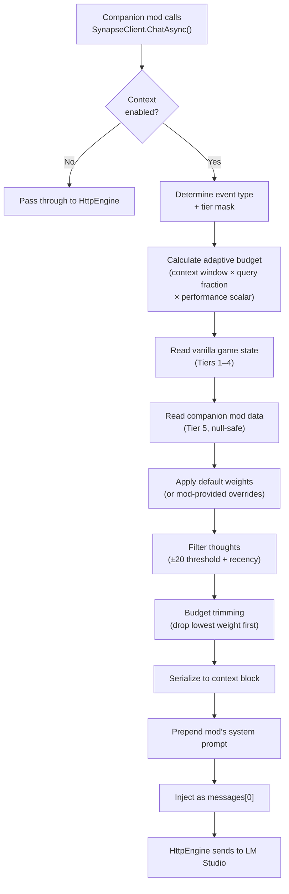

# Context Embedding — Planning Iteration 2 (Core Only)

> Second iteration. All companion-mod-specific ideas have been extracted to their
> respective repos. This document covers **only what Core does**.
>
> Core is **vanilla+**: it reads RimWorld's game state, assembles it with budget
> trimming, and injects it alongside mod-defined system prompts. No LLM analysis
> calls. No narrative intelligence. No memory creation.
>
> **Status:** Pending review.

---

## 1. Core's Responsibility Boundary

```
Core DOES                                Core DOES NOT
─────────────────────────────────        ─────────────────────────────────────
Read vanilla game state (APIs)           Make LLM calls to interpret game state
Assemble context into structured text    Detect backstory ↔ event resonance
Apply default weight table               Dynamically boost weights (Storyteller)
Trim to adaptive token budget            Track faction goodwill integrals (Storyteller)
Inject context as system message         Generate backstories for new pawns (Storyteller)
Provide ContextTierMask defaults         Create or store pawn memories (Psychology)
Read SynapsePawnComp IF present          Export/import memory data (Storyteller/DevTools)
Read SynapseWorldComponent IF present    Persist conversation history (Chat)
Accept per-mod system prompts            Define narrative threads (Storyteller)
```

---

## 2. Game-State Taxonomy (What Core Can Read)

### Tier 1 — Identity (always included, ~45 tokens)

| Field | Source API | Notes |
|---|---|---|
| Pawn name | `pawn.Name.ToStringShort` | |
| Pawn ID | `pawn.ThingID` | Internal reference |
| Gender | `pawn.gender` | |
| Biological age | `pawn.ageTracker.AgeBiologicalYears` | |
| Backstory (childhood) | `pawn.story?.childhood?.title` + `baseDesc` | Raw vanilla text |
| Backstory (adulthood) | `pawn.story?.adulthood?.title` + `baseDesc` | Raw vanilla text |
| Traits | `pawn.story?.traits?.allTraits` | Label + Degree |

### Tier 2 — Pawn State (~250–400 tokens)

| Field | Source API | Notes |
|---|---|---|
| Mood level | `pawn.needs?.mood?.CurLevel` | 0.0–1.0 |
| Active thoughts | `pawn.needs?.mood?.thoughts` | Filtered: ≥±20 impact OR <12h old |
| Skills | `pawn.skills?.skills` | Label, Level, Passion |
| Health / hediffs | `pawn.health?.hediffSet?.hediffs` | Label, Severity, body part |
| Direct relationships | `pawn.relations?.DirectRelations` | Spouse, Rival, Friend, etc. |
| Opinion scores | `pawn.relations?.OpinionOf(other)` | Top N by absolute value |
| Current job | `pawn.CurJob` | What they're doing now |
| Equipment / apparel | `pawn.equipment`, `pawn.apparel` | Item labels |
| Ideology | `pawn.Ideo?.name` | DLC-safe (null if absent) |
| Royalty title | `pawn.royalty` | DLC-safe (null if absent) |

### Tier 3 — Colony (~60–100 tokens)

| Field | Source API | Notes |
|---|---|---|
| Colonist count | `map.mapPawns.FreeColonistsCount` | |
| Total wealth | `map.wealthWatcher.WealthTotal` | |
| Season | `GenLocalDate.Season(map)` | |
| Weather | `map.weatherManager.curWeather.label` | |
| Biome | `map.Biome.label` | |
| Danger level | `map.dangerWatcher.DangerRating` | |
| Current research | `Find.ResearchManager` | Project name + progress % |
| Recent incidents | `Find.LetterStack` | Last 3–5 |

### Tier 4 — World / Factions (~80–200 tokens)

| Field | Source API | Notes |
|---|---|---|
| Faction list | `Find.FactionManager.AllFactionsVisible` | Name, type, goodwill |
| Faction relation kind | `faction.PlayerRelationKind` | Hostile / Neutral / Ally |
| Faction leader | `faction.leader?.Name` | May be null |
| Active quests | `Find.QuestManager.QuestsListForReading` | Name + state |

> [!NOTE]
> Core reads **raw faction goodwill** (a single int per faction). The goodwill
> integral, trajectory, and power/ideology/opportunity analysis lives in
> Storyteller. If Storyteller provides enriched faction data via its WorldComponent,
> Core will include it — but Core doesn't compute it.

### Tier 5 — Companion Mod Data (0 tokens if mods absent)

| Field | Source | Notes |
|---|---|---|
| Weighted memories | `SynapsePawnComp` (Psychology) | `TryGetComp` — null if absent |
| Personality summary | `SynapsePawnComp` (Psychology) | |
| Opinion integral | `SynapsePawnComp` (Psychology) | |
| Narrative threads | `SynapseWorldComponent` (Storyteller) | Read if component exists |
| Faction trackers | `SynapseWorldComponent` (Storyteller) | Read if component exists |

Core reads this data **if available** via null-safe access. If companion mods aren't loaded, Tier 5 is simply empty — zero tokens, zero errors.

---

## 3. Per-Mod System Prompts

Each companion mod registers its own system prompt. Core injects context **after** the mod's prompt:

```
messages[0] = {
  role: "system",
  content:
    [MOD'S SYSTEM PROMPT]
    ---
    [CORE-ASSEMBLED CONTEXT BLOCK]
}
```

### Registration API

```csharp
public static class SynapseCore
{
    public static SynapseModHandle Register(
        string modId,
        string displayName,
        string systemPrompt = null);  // mod's base system prompt
}

public class SynapseModHandle
{
    public string SystemPrompt { get; set; }
    public ContextTierMask DefaultTiers { get; set; } = ContextTierMask.Standard;
}
```

### ContextTierMask Defaults

Core provides sensible defaults per event type. Companion mods can override, but if they don't specify, these apply:

```csharp
[Flags]
public enum ContextTierMask
{
    None          = 0,
    Identity      = 1 << 0,   // Tier 1
    PawnState     = 1 << 1,   // Tier 2
    Colony        = 1 << 2,   // Tier 3
    World         = 1 << 3,   // Tier 4
    Synthetic     = 1 << 4,   // Tier 5

    // Embedded defaults — used when mod doesn't specify
    Standard      = Identity | PawnState | Synthetic,           // dialogue, chat
    ColonyEvent   = Identity | Colony | World,                  // storyteller events
    Full          = Identity | PawnState | Colony | World | Synthetic,
    Lightweight   = Identity,                                   // quick thoughts
}

// Default mapping (used if mod doesn't override)
public static ContextTierMask GetDefaultTiers(string eventType)
{
    return eventType switch
    {
        "thought"      => ContextTierMask.Lightweight,
        "dialogue"     => ContextTierMask.Standard,
        "relationship" => ContextTierMask.Standard,
        "reaction"     => ContextTierMask.Identity | ContextTierMask.PawnState,
        "event"        => ContextTierMask.ColonyEvent,
        "quest"        => ContextTierMask.Full,
        "custom"       => ContextTierMask.Standard,
        _              => ContextTierMask.Standard,
    };
}
```

---

## 4. Adaptive Token Budget

No fixed user setting. Derived from LM Studio's reported context window.

### Calculation

```
availableContextWindow = ModelManager.ContextLength ?? 4096

reservedForCompletion   = max(512, availableContextWindow × 0.25)
reservedForConversation = estimateTokens(messageHistory)
reservedForSystemPrompt = estimateTokens(mod.SystemPrompt)

contextBudget = availableContextWindow
              - reservedForCompletion
              - reservedForConversation
              - reservedForSystemPrompt

// Performance scaling
if (avgResponseTimeMs > 10000)
    contextBudget *= 0.6
else if (avgResponseTimeMs > 5000)
    contextBudget *= 0.8
```

### Query-Type Budget Fractions

| Query Type | Fraction | Frequency | Rationale |
|---|---|---|---|
| `thought` | 15% | High | Lightweight pawn reactions |
| `dialogue` | 50% | On interaction | Rich in-character context |
| `relationship` | 35% | On social event | Social-focused |
| `reaction` | 25% | On event trigger | Quick response |
| `event` | 70% | Every 2–3 days | Deep, infrequent |
| `quest` | 60% | On quest events | Full world state |
| `custom` | 50% | Variable | Mod-specific |

---

## 5. Thought Filtering

Core reads vanilla thought data using a **threshold + recency** filter:

```
Include if:
  |moodOffset| >= 20    — significant mood impact
  OR
  age < 12 in-game hours — recent regardless of impact

Exclude:
  - Stacking duplicates (include once, note count)
  - Thoughts at > 90% of expiration duration
```

This is reading vanilla RimWorld data, not creating anything — squarely Core's job.

---

## 6. Default Weight Table

These are **static base weights**. Core does not boost them dynamically — that's Storyteller's domain. Companion mods can provide weight overrides via `ChatOptions.weightOverrides`.

```
Slot                      Base Weight    Required
────────────────────────  ───────────    ────────
Pawn name / identity      10             yes
Event type framing        10             yes
Backstory                  6             no
Traits                     7             no
Current mood               7             no
Active thoughts            5             no
Skills                     4             no
Health / hediffs           5             no
Direct relationships       6             no
Opinion scores             5             no
Ideology / precepts        4             no
Colony stats               4             no
Faction list (raw)         4             no
Weather / season / biome   2             no
Weighted memories (T5)     6             no
Narrative threads (T5)     5             no
AI personality (T5)        6             no
```

### Budget Trimming Algorithm

```
1. Gather all slots with their base weights
   (or mod-provided overrides if present)
2. Sort by weight descending
3. Walk the list, accumulating token estimates (len / 4)
4. When budget exceeded, drop remaining slots
5. Required slots (weight 10) are NEVER dropped
6. Return: assembled text, slots_filled[], slots_dropped[]
```

---

## 7. Data Model

```csharp
// ── Core packet (what Core assembles) ──────────────────
public class ContextPacket : IExposable
{
    public string eventType;
    public string framing;
    public int    gameTick;

    public PawnPacket    sourcePawn;
    public PawnPacket    targetPawn;
    public ColonyPacket  colony;
    public WorldPacket   world;

    // Tier 5 — populated from companion mod data if available
    public List<WeightedMemory>   memories;
    public List<NarrativeThread>  narrativeThreads;

    public ContextSettings settings;
    public void ExposeData() { /* Scribe each field */ }
}

// ── Pawn data (assembled from vanilla APIs + optional comp) ──
public class PawnPacket : IExposable
{
    // Tier 1 — Identity
    public string pawnId;
    public string name;
    public string gender;
    public int    age;
    public string backstoryChildhood;
    public string backstoryAdulthood;
    public List<string> traits;

    // Tier 2 — State
    public float  moodLevel;
    public List<ThoughtEntry> thoughts;
    public Dictionary<string, int> skills;
    public List<string> passions;
    public List<string> healthConditions;
    public List<string> equipment;

    // Tier 2 — Social
    public List<RelationshipEntry> relationships;
    public List<OpinionEntry>      opinions;

    // Tier 2 — DLC (nullable)
    public string ideology;
    public List<string> precepts;
    public string royaltyTitle;

    // Tier 5 — From Psychology (null if mod absent)
    public string personalitySummary;
    public float? opinionIntegral;

    public void ExposeData() { /* Scribe each field */ }
}

public class ThoughtEntry : IExposable
{
    public string label;
    public float  moodOffset;
    public float  ageHours;
    public bool   isRecent;
    public void ExposeData() { /* ... */ }
}

public class ColonyPacket : IExposable
{
    public int    colonistCount;
    public float  wealthTotal;
    public string season;
    public string weather;
    public string biome;
    public string dangerLevel;
    public string currentResearch;
    public float  researchProgress;
    public List<string> recentEvents;
    public void ExposeData() { /* ... */ }
}

public class WorldPacket : IExposable
{
    public List<FactionEntry> factions;
    public List<string>       activeQuestNames;
    public void ExposeData() { /* ... */ }
}

public class FactionEntry : IExposable
{
    public string factionName;
    public string factionType;
    public string relationKind;     // Hostile / Neutral / Ally
    public int    goodwill;         // raw vanilla value
    public string leaderName;       // null if unknown

    // Enriched fields — populated by Storyteller if loaded
    public float? goodwillIntegral;
    public string trajectory;
    public string power;
    public string opportunityLevel;

    public void ExposeData() { /* ... */ }
}

public class ContextSettings : IExposable
{
    public bool includeBackstory      = true;
    public bool includeTraits         = true;
    public bool includeMood           = true;
    public bool includeSkills         = true;
    public bool includeHealth         = true;
    public bool includeRelationships  = true;
    public bool includeOpinions       = true;
    public bool includeEquipment      = false;
    public bool includeIdeology       = true;
    public bool includeColony         = true;
    public bool includeFactions       = false;
    public bool includeQuests         = false;
    public bool includeMemories       = true;
    public bool includeThreads        = true;

    public int   memoryLimit     = 5;
    public int   opinionLimit    = 5;
    public int   eventLimit      = 5;
    public float weightThreshold = 0.15f;

    public void ExposeData() { /* Scribe each field */ }
}
```

---

## 8. Save File Integration

### What Core Saves

```
ModSettings (Config/RimSynapse.RimSynapseSettings.xml)
├── lmStudioUrl
├── enableContextEmbedding = false          ← NEW (opt-in)
└── ... (existing settings)

Save File (.rws) — only if persist enabled
└── <World>
    └── <components>
        └── <li Class="RimSynapse.SynapseContextWorldComponent">
            ├── <contextVersion>1</contextVersion>
            └── <lastContextJson>...</lastContextJson>
```

Core's save footprint is **minimal** — one WorldComponent with a version number and an optional cached context JSON. All the heavy persistence (memories, threads, faction trackers) lives in companion mod components.

### Mod Addition / Removal

| Scenario | Behavior | Risk |
|---|---|---|
| Add Core to existing save | WorldComponent created with defaults. No errors. | ✅ Zero risk |
| Remove Core from save | Log warning for missing WorldComponent. Skipped. Save loads fine. | ⚠️ Low risk |
| Companion mod removed | Core null-checks `TryGetComp` / component access. Fields are empty. | ⚠️ Low risk |

---

## 9. Context Assembly Pipeline



---

## 10. New/Modified Files

### New Files

| File | Purpose |
|---|---|
| `Source/Models/ContextPacket.cs` | Data models: ContextPacket, PawnPacket, ColonyPacket, WorldPacket, FactionEntry, ThoughtEntry, ContextSettings, ContextTierMask |
| `Source/Internal/ContextAssembler.cs` | Reads vanilla game state, reads companion comp data (null-safe), applies weight table, runs budget trimming, serializes context block |
| `Source/Internal/ThoughtFilter.cs` | ±20 threshold + <12h recency filter for vanilla thoughts |
| `Source/Internal/QueryBudgetProfile.cs` | Per-event-type budget fractions, adaptive budget from LM Studio context window, performance scaling |
| `Source/SynapseCoreContext.cs` | Public façade: SetContext(), ClearContext(), GetContext() |
| `Source/SynapseContextWorldComponent.cs` | Minimal WorldComponent: version field + optional context persistence |
| `docs/CONTEXT_API_README.md` | Comprehensive companion mod developer documentation |

### Modified Files

| File | Changes |
|---|---|
| `Source/RimSynapseSettings.cs` | Add `enableContextEmbedding` toggle |
| `Source/SynapseCore.cs` | Add `systemPrompt` to `Register()` |
| `Source/Models/SynapseModHandle.cs` | Add `SystemPrompt`, `DefaultTiers` |
| `Source/Models/ChatOptions.cs` | Add `eventType`, `contextTiers`, `weightOverrides` |
| `Source/Internal/HttpEngine.cs` | Merge context block into system message |
| `Source/Internal/ModelManager.cs` | Add `ContextPayload` field |
| `Source/Internal/RequestQueue.cs` | Trigger context assembly before dispatch |
| `Source/RimSynapseMod.cs` | Add Context Embedding toggle to settings UI |

---

## 11. Companion Mod Design Documents Created

The following design addenda were extracted from planning-1 and placed in their respective repos:

| Repo | Document | Key Ideas |
|---|---|---|
| **RimSynapse-StoryTeller** | `DESIGN_CONTEXT_INTELLIGENCE.md` | Backstory resonance engine, robust backstory generation on pawn arrival, faction goodwill integral tracking, power/ideology/opportunity, dynamic weight boosting, memory export/import |
| **RimSynapse-Psychology** | `DESIGN_CONTEXT_INTEGRATION.md` | Backstory memory storage (planted by Storyteller), AddMemory/BumpMemory API, opinion integral exposure for Core to read |
| **RimSynapse-Chat** | `DESIGN_CONTEXT_ACTIONS.md` | In-memory universe actions via game engine APIs, delegation to Psychology for memory formation, conversation context tier requests |

---

*Planning iteration 2 — Core scope only, companion mod ideas extracted.*
