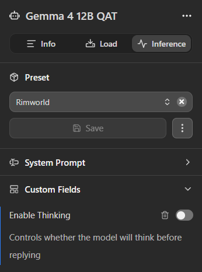

# RimSynapse Core

A C# library mod for RimWorld that provides a clean API for other mods to make local LLM calls via LM Studio, Ollama, or any OpenAI-compatible backend.

**This is a library mod** — it does nothing on its own. Install mods that depend on RimSynapse Core to add AI features to your game.

## Features

- **Async LLM Calls** — Background-threaded HTTP to LM Studio, never freezes the game
- **Dynamic Request Queue** — Serialized requests with per-mod budget allocation
- **Response Sanitization** — Strips `<think>` blocks, repairs broken JSON, cleans markdown
- **Auto Model Discovery** — Queries and auto-maps to the active LM Studio model
- **Keep-Alive** — Pings LM Studio every 4 minutes to prevent model unloading
- **GPU Framework** — Data structures for GPU monitoring (polling provided by separate mod)
- **Debug Logging** — Structured logging with subscribable events

## Requirements and Setup

- [RimWorld 1.5](https://store.steampowered.com/app/294100/RimWorld/)
- [Harmony](https://steamcommunity.com/workshop/filedetails/?id=2009463077)
- [LM Studio](https://lmstudio.ai/) or [Ollama](https://ollama.com/) running locally with a model loaded (8B+ parameter models recommended)

### ⚠️ IMPORTANT: Reasoning/Thinking Models (DeepSeek-R1, Gemma-QAT, etc.)
If you use a reasoning model, it will generate a long internal "chain-of-thought" (reasoning) process before returning the final text. This can add **30-40 seconds of latency** per query on local setups.
*   **To disable thinking in LM Studio:** Go to the **My Models** tab, select your active model, and in the right-hand **Inference Settings** panel, toggle **Enable Thinking** to **OFF**.

    

*   **To disable thinking in Ollama and vLLM:** Check the **"Disable thinking/reasoning"** checkbox under the in-game RimSynapse Core mod settings.
*   **Recommendation:** For the fastest, instant responses (2-3 seconds), we recommend using standard non-reasoning **"Instruct"** models (such as `gemma-2-9b-it` or `llama-3-8b-instruct`).

## Quick Start for Mod Developers

### 1. Reference RimSynapseCore.dll

Add a reference to `RimSynapseCore.dll` in your mod's `.csproj` and declare the dependency in your `About.xml`:

```xml
<modDependencies>
    <li>
        <packageId>RimSynapse.Core</packageId>
        <displayName>RimSynapse Core</displayName>
    </li>
</modDependencies>
```

### 2. Register Your Mod

```csharp
using RimSynapse;

[StaticConstructorOnStartup]
public static class MyModInit
{
    public static SynapseModHandle Handle;

    static MyModInit()
    {
        Handle = SynapseCore.Register("myname.mymod", "My Cool AI Mod");
    }
}
```

### 3. Make LLM Calls

```csharp
// Simple prompt
SynapseClient.PromptAsync(
    MyModInit.Handle,
    "You are a helpful RimWorld advisor.",
    "What should my colony prioritize?",
    result =>
    {
        if (result.success)
            Log.Message($"LLM says: {result.content}");
        else
            Log.Error($"LLM error: {result.error}");
    });

// Full chat with history
var messages = new List<ChatMessage>
{
    ChatMessage.System("You are a RimWorld colonist named Engie."),
    ChatMessage.User("How are you feeling today?"),
};

SynapseClient.ChatAsync(
    MyModInit.Handle,
    messages,
    new ChatOptions { temperature = 0.8f },
    result => { /* handle response */ });

// From JSON string
SynapseClient.ChatFromJsonAsync(
    MyModInit.Handle,
    "{\"system\": \"You are an advisor.\", \"user\": \"Help!\"}",
    result => { /* handle response */ });
```

## Configuration

In-game: **Options → Mod Settings → RimSynapse Core**

| Setting | Default | Description |
|---------|---------|-------------|
| LM Studio URL | `http://127.0.0.1:1234` | Your LM Studio server address |
| API Key | *(empty)* | Bearer token if LM Studio auth is enabled |
| Auto-map model | ✅ | Use the first loaded model automatically |
| Sanitize responses | ✅ | Clean LLM output (strip think blocks, fix JSON) |
| Keep-alive pings | ✅ | Prevent model unloading |
| Timeout | 120s | HTTP request timeout |
| Max requests/min | 30 | Global rate limit |
| Mod budgets | Equal split | Per-mod query allocation sliders |

## Building from Source

1. Clone this repo
2. Edit `Source/GamePath.props` to point to your RimWorld install
3. Build with `dotnet build Source/RimSynapseCore.csproj`
4. Output: `Assemblies/RimSynapseCore.dll`

## License

MIT
